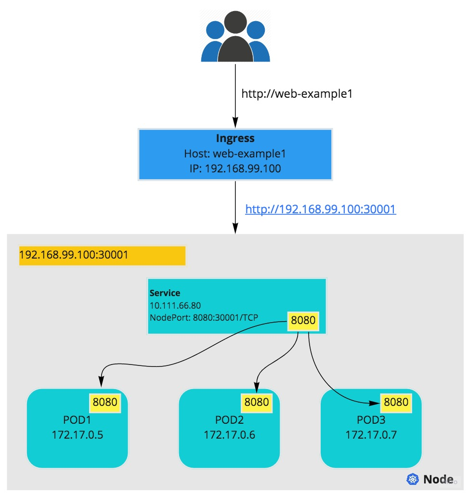

# Using minikube + docker to deploy a GO web application 

## web example1 diagram

## Steps:
* Install minikube: https://kubernetes.io/docs/tasks/tools/install-minikube/, commands ran in my MAC:
    * install virtualbox
    * brew install minikube
    * brew install kubectl
    * minikube start
* Write a sample go code and build docker image
    * sample go code in `docker_image/web_example.go`
    * sampel dockerfile in `docker_image/Dockerfile`
    * test this sample web app using docker: 
        * `docker build -t web-example; docker run -it -rm web-example -p localhost; curl http://localhost:8080`
* Build yaml files for kubernetes deployment/service/ingress
    * Build kubernetes deployment with above docker image: `./web-example-deployment.yml`
    * Build kubernetes service to point to above deployment pods: `./web-example-service.yml`
    * Before build ingress using minikube, need install ingress controller(minikube use nginx): `minikube addons enable ingress` 
    * Verify ingress controller in minikube: `kubectl -n kube-system get pods`
    * Build ingress to point to above service: `./web-example-ingress.yml`
    * kubectl deploy above deployment/service/ingress
        * deploy pods: `kubectl apply -f web-example-deployment.yml`
        * deploy service: `kubectl apply -f web-example-service.yml`, you can find node:port using `minikube service --url`
        * deploy ingress: `kubectl apply -f web-example-ingress.yml`, you can find hostname/ip:port using `kubectl get ingress` 
