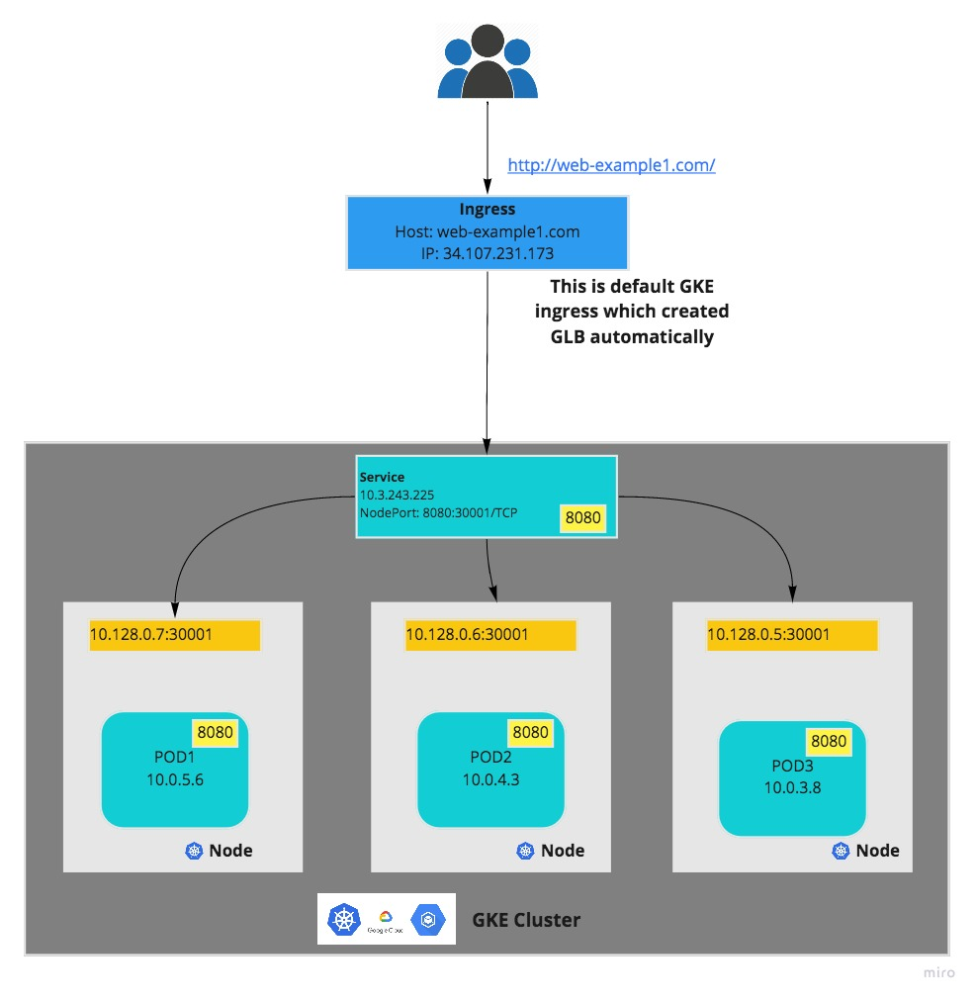

# Using minikube + docker to deploy a GO web application 

## web example1 diagram

## Steps:
* Provision GKE cluster using terraform
    * terraform code repo: https://github.com/andy0301/my_practice/tree/master/terraform/gcp_configs/gke_exmaple1
    * deploy steps:
    * `git clone https://github.com/andy0301/my_practice.git`
    * `cd terraform/gcp_configs/gke_exmaple1`
    * `terrform init; terraform apply`
* Setting kubectl access to GKE cluster
    * `gcloud auth login`
    * `gcloud config set project <project_id>`
    * `gcloud container clusters get-credentials <gke cluster name> --region <region name>`
* Build yaml files for kubernetes deployment/service/ingress
    * Build kubernetes deployment with above docker image: `./web-example-deployment.yml`
    * Build kubernetes service to point to above deployment pods: `./web-example-service.yml`
    * Build ingress to point to above service: `./web-example-ingress.yml`
    * kubectl deploy above deployment/service/ingress
        * deploy pods: `kubectl apply -f web-example-deployment.yml`
        * deploy service: `kubectl apply -f web-example-service.yml`
        * deploy ingress: `kubectl apply -f web-example-ingress.yml`
    * verify deployment
        * verify from google console: https://console.cloud.google.com/kubernetes/discovery?authuser=2&project=green-reporter-266619
        * verify from kubectl:
            * `kubectl get pods`
            * `kubectl get services`
            * `kubectl get ingress`

